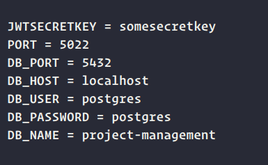

# Project Management System

Combine the frontend and backend parts to create complete Project Management System.

Frontend folder: `project-management/`

Backend folder: `project-management-backend/`

## Prerequisites

1. **Env** Create a .env file inside the 'project-management-backend' folder and include following details into it 

  
  
  Put database credentials for your postgres database in variables with DB_ prefix, 5022 as PORT which will be the port used by connected frontend application and enter some secret value for JWTSECRETKEY which will be used for JSONwebtokens.

2. **Installation** `npm install` or `yarn install` on both folders for frontend and backend to install the required dependencies. Rest of the guide will assume you have yarn installed or follow along with respective npm commands.

## Usage

1. In the backend folder, run the following commands to setup the database.

`yarn migrate`

`yarn seed`

2. Run the command in backend directory to run backend on the PORT 5022 (change BASE_URL in frontend at `src/utils/constants` in case PORT needs to be changed) to be provided.

`yarn start:dev`

3. Run the command in frontend directory to get frontend up and running. 

Feel free to contact me at `mousamdhakal7.md@gmail.com` in case of any inconvenience.